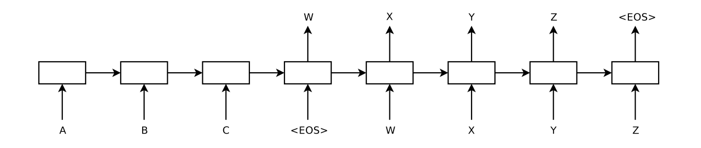
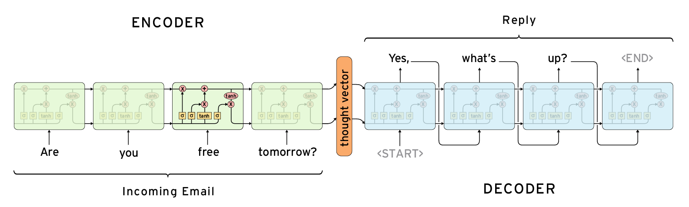

# seq2seq with TensorFlow
Collection of unfinished tutorials. May be good for educational purposes.

## **1 - [simple sequence-to-sequence model with dynamic unrolling](1-seq2seq.ipynb)**
> Deliberately slow-moving, explicit tutorial. I tried to thoroughly explain everything that I found in any way confusing.

> Implements simple seq2seq model described in [Sutskever at al., 2014](https://arxiv.org/abs/1409.3215) and tests it against toy memorization task.

*Picture from [Sutskever at al., 2014](https://arxiv.org/abs/1409.3215)*

## **2 - [advanced dynamic seq2seq](2-seq2seq-advanced.ipynb)**
> Encoder is bidirectional now. Decoder is implemented using `tf.nn.raw_rnn`. It feeds previously generated tokens during training as inputs, instead of target sequence.

*Picture from [Deep Learning for Chatbots](http://www.wildml.com/2016/04/deep-learning-for-chatbots-part-1-introduction/)*

## **3 - [Using `tf.contrib.seq2seq`](3-seq2seq-native-new.ipynb)** (TF<=1.1)
> New dynamic seq2seq appeared in r1.0. Let's try it.

UPDATE: that this tutorial doesn't work with tf version > 1.1, API. I recommend checking out new [official tutorial](https://github.com/tensorflow/nmt) instead to learn high-level seq2seq API.
